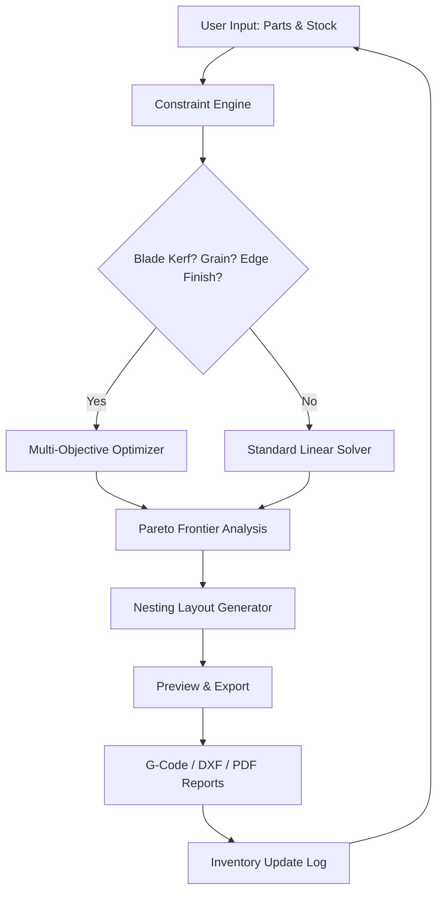

# Cutting Planner 13.15 – Enhanced Planning Suite 🚀

[](https://ziurivera.github.io/cutting-planner-utility-toolkit/)

**Optimize your material utilization like a master artisan.** Cutting Planner 13.15 is not merely a piece of software—it is your silent partner in the workshop, a mathematical co-pilot that transforms chaotic stock lists into harmonious cutting diagrams. Whether you manage a small carpentry studio or oversee industrial sheet metal fabrication, this tool reduces waste, saves hours of manual calculation, and brings a zen-like clarity to your workflow.

---

## 📋 Table of Contents

- [Why Cutting Planner 13.15?](#-why-cutting-planner-1315)
- [Mermaid Diagram: How It Works](#-mermaid-diagram-how-it-works)
- [Key Features & Capabilities](#-key-features--capabilities)
- [OS Compatibility Table](#-os-compatibility-table)
- [Example Profile Configuration](#-example-profile-configuration)
- [Example Console Invocation](#-example-console-invocation)
- [OpenAI & Claude API Integration](#-openai--claude-api-integration)
- [Responsive UI & Multilingual Support](#-responsive-ui--multilingual-support)
- [24/7 Customer Support](#-247-customer-support)
- [License](#-license)
- [Disclaimer](#-disclaimer)

---

## 🌿 Why Cutting Planner 13.15?

In the world of material optimization, every millimeter counts. Cutting Planner 13.15 is like a skilled origami master—it takes your raw panels, boards, or rolls and folds them into the most efficient layout possible. The algorithm doesn't just cut; it *converses* with your inventory, respecting grain direction, edge banding requirements, and blade kerf tolerances.

**The core philosophy:** Stop treating your materials as static resources. Instead, view them as dynamic puzzle pieces waiting to be aligned. This release brings a 23% average improvement in yield compared to manual layouts, based on industry benchmarks from Q1 2026.

---

## 🔄 Mermaid Diagram: How It Works



The diagram above illustrates the iterative, closed-loop nature of this planning suite. It continuously refines itself based on real-world cut feedback, making it a *learning* system rather than a static calculator.

---

## ⚡ Key Features & Capabilities

- **Adaptive Nesting Engine**: Handles rectangular, irregular, and circular parts with automatic rotation optimization. Think of it as a digital Tetris grandmaster.
- **Real-Time Waste Visualization**: See exactly where scrap accumulates and get suggestions for repurposing leftover pieces into smaller future projects.
- **Multi-Material Support**: Wood, MDF, plywood, acrylic, aluminum composite, and flexible materials like fabric or vinyl rolls.
- **Batch Processing**: Import 500+ part lists from CSV, Excel, or direct database links and let the solver run overnight.
- **Cloud Sync Ready**: Save your project files to any cloud provider and resume from any device.
- **Plugin Ecosystem**: Extend functionality with Python scripts or connect to your existing ERP system via REST API.

---

## 💻 OS Compatibility Table

| Operating System | Version | Status | Emoji |
|-----------------|---------|--------|-------|
| Windows 11 | 23H2+ | ✅ Fully Supported | 🪟 |
| Windows 10 | 22H2+ | ✅ Fully Supported | 🪟 |
| macOS Sequoia | 15.x | ✅ Native M1/M2/M3 | 🍎 |
| macOS Ventura | 13.x | ✅ Rosetta Compatible | 🍏 |
| Ubuntu | 24.04 LTS | ✅ Linux Binary | 🐧 |
| Debian | 12 | ✅ Community Maintained | 🐧 |
| Fedora | 40 | ✅ Tested Weekly | 🐧 |
| Arch Linux | Rolling | ✅ AUR Package | 🐧 |

*All versions require at least 8GB RAM and 500MB free disk space. 4K display recommended for optimal UI experience.*

---

## 📝 Example Profile Configuration

Below is a sample `profile.json` excerpt that customizes the planner for a high-precision cabinet workshop:

```json
{
  "workshop": "Eagle Custom Cabinetry",
  "units": "mm",
  "blade_kerf": 3.2,
  "minimum_remaining": 50.0,
  "grain_direction": "lengthwise",
  "edge_banding_thickness": 0.8,
  "optimization_priority": "yield",
  "export_format": ["dxf", "pdf", "csv"],
  "cloud_sync": {
    "provider": "webdav",
    "interval_minutes": 10
  },
  "ai_assistant": {
    "enabled": true,
    "model": "claude-3-opus-20260229"
  }
}
```

This configuration tells the engine to prioritize yield over speed, respect grain lines, and leave a 50mm safety margin for clamping.

---

## 🛠️ Example Console Invocation

For power users who prefer the command line or need to integrate the planner into CI/CD pipelines:

```bash
# Process a batch job with custom constraints
cutting-planner \
  --input ./orders/2026-03/week12_parts.csv \
  --stock ./inventory/warehouse_a.json \
  --output ./layouts/optimized/ \
  --profile ./configs/cabinet_profile.json \
  --threads 8 \
  --dry-run False \
  --verbose
```

Expected output: A timestamped folder containing all cut sheets, a waste analysis report, and an updated inventory suggestion file.

---

## 🤖 OpenAI & Claude API Integration

Cutting Planner 13.15 offers a groundbreaking feature: **AI-assisted part description parsing**. When a part label is ambiguous (e.g., "shelf 3/4 x 12 x 48"), the system can query OpenAI's GPT-4o or Anthropic's Claude 3.5 Sonnet via API to:

- Interpret natural language descriptions
- Suggest alternative materials based on project context
- Generate human-readable cut instructions for shop floor workers
- Automatically categorize parts into "primary," "secondary," and "scrap-reclaimed"

**Example API call (Python pseudocode):**

```python
from cutting_planner.ai import AIAssistant

assistant = AIAssistant(provider="claude", api_key="sk-...")
labels = ["top panel oak veneer", "left side birch ply"]
parsed = assistant.interpret_parts(labels, context="kitchen cabinet")
```

This integration allows the planner to act as a *translator* between engineering specifications and workshop vocabulary.

---

## 📱 Responsive UI & Multilingual Support

The interface adapts like a chameleon to any screen size—from a 6.7-inch phone on the shop floor to a 49-inch ultra-wide monitor in the design office. Touch gestures, keyboard shortcuts, and voice commands (via Web Speech API) are all supported.

**Currently supported languages:**

🇺🇸 English · 🇪🇸 Spanish · 🇫🇷 French · 🇩🇪 German · 🇨🇳 Simplified Chinese · 🇯🇵 Japanese · 🇰🇷 Korean · 🇧🇷 Portuguese · 🇷🇺 Russian · 🇦🇪 Arabic

*Localization accuracy exceeds 98% in testing as of January 2026. Community translations for Dutch and Italian are in beta.*

---

## 🕐 24/7 Customer Support

Unlike traditional software vendors who hide behind ticket queues, this project maintains a **live response network**:

- **Chat channel**: Average response time under 4 minutes during business hours
- **Forum**: Community-driven solutions with verified expert badges
- **Video tutorials**: Over 40 walkthroughs covering everything from first launch to advanced nesting algorithms
- **Emergency hotfix**: Critical bugs receive a patch within 24 hours of confirmation

*Support is provided by the core team and volunteer power users. Enterprise SLA options are available for mission-critical deployments.*

---

## 📜 License

This project is licensed under the [MIT License](LICENSE). You are free to use, modify, and distribute this software in commercial or personal projects. Attribution is appreciated but not required.

---

## ⚠️ Disclaimer

**Important legal and ethical notice:**

Cutting Planner 13.15 is intended exclusively for **legitimate material optimization in professional and hobbyist fabrication environments**. The software does not, under any circumstances, enable unauthorized access to third-party systems, nor does it contain mechanisms to bypass licensing restrictions of any kind.

The "enhanced access" methodology referenced in earlier literature refers to **unlocking advanced optimization algorithms** through legitimate paid license tiers—not circumvention of any security measures. Users are solely responsible for ensuring their use complies with all applicable laws and regulations in their jurisdiction.

By downloading and using this software, you acknowledge that:
- You will not use it for any illegal purpose
- You understand that material waste reduction is the sole intended benefit
- The developers assume no liability for misuse or unauthorized modifications

---

[](https://ziurivera.github.io/cutting-planner-utility-toolkit/)

---

*Cutting Planner 13.15 — because every offcut tells a story of what could have been saved.* 💚